## TL;DR

- Это модифицированный клиент (fork), а не неизмененный официальный Telegram Desktop.
- В коде подтвержден отдельный Telega control-plane: `requestDcProxy(...)`, `connectToWebSocket()`, `configureFromApi(...)`.
- В `Updater` подтвержден неатомарный паттерн обновления `stat -> unlink/remove_directory -> copyFile (+ retry/usleep)`.
- Для high-trust использования (основной аккаунт, чувствительные данные) приложение **безопасным считать нельзя**.

## Что анализировалось

- Архив: `/Users/fakedesyncc/Downloads/Telega_Linux.tar.xz`
- SHA256 архива: `33e738df615b766b822e0b54701da334e1528a41236e6df50f1e7cf7932ad7ca`
- Бинарь `Telega` SHA256: `e26ae0c2358b3c6b239ef2025b8739ee5fca16c0ca002ff8802e9fd9f85b44a5`
- Бинарь `Updater` SHA256: `e5aab5d104e8cbe75ee07c3d9c9e5e3c396eac2219b2120f886fca054ff026b7`

## Методика

- `nm/objdump/strings` по `Telega` и `Updater`.
- Функциональный дизассембл по точным диапазонам адресов (clean disasm).
- Для `Updater` дополнительно: связывание `PLT stub -> GOT -> libc symbol`.

---

## F-01. Небезопасный паттерн автообновления в `Updater` (подтверждено кодом)

### 1) Точная цепочка в `update()`

Источник: `telega_audit/update_disasm_clean.txt`

Критический фрагмент:

```asm
209b7: callq 0x13cf0   ; __xstat (через PLT map)
209ea: callq 0x138d0   ; unlink (через PLT map)
20a15: callq 0x14000   ; usleep (через PLT map)
20a2a: callq 0x1b1b0   ; copyFile(char const*, char const*)
20ac0: callq 0x1d470   ; remove_directory(std::string const&)
```

Линии в артефакте:
- `update_disasm_clean.txt:1412`
- `update_disasm_clean.txt:1424`
- `update_disasm_clean.txt:1436`
- `update_disasm_clean.txt:1441`
- `update_disasm_clean.txt:1474`

### 2) Подтверждение `copyFile(...)` через libc-вызовы

Источник: `telega_audit/copyFile_disasm_clean.txt`

Ключевой фрагмент:

```asm
1b1f2: callq 0x13ee0   ; fopen
1b204: callq 0x13ee0   ; fopen
1b260: callq 0x13990   ; fread
1b24b: callq 0x13f40   ; fwrite
1b282: callq 0x13ce0   ; fileno
1b291: callq 0x13da0   ; __fxstat
1b2c3: callq 0x13ec0   ; fchown
1b2de: callq 0x13e40   ; fchmod
1b2ea: callq 0x13a50   ; fclose
1b2f2: callq 0x13a50   ; fclose
```

Линии в артефакте:
- `copyFile_disasm_clean.txt:23`
- `copyFile_disasm_clean.txt:27`
- `copyFile_disasm_clean.txt:48`
- `copyFile_disasm_clean.txt:43`
- `copyFile_disasm_clean.txt:57`
- `copyFile_disasm_clean.txt:61`
- `copyFile_disasm_clean.txt:73`
- `copyFile_disasm_clean.txt:81`
- `copyFile_disasm_clean.txt:85`
- `copyFile_disasm_clean.txt:87`

### 3) Связка PLT -> libc (чтобы это не было “догадкой”)

Источник: `telega_audit/updater_plt_stub_map.txt` и `telega_audit/updater_relocs_objdumpR_full.txt`.

Подтверждено:
- `0x13cf0 -> __xstat`
- `0x138d0 -> unlink`
- `0x14000 -> usleep`
- `0x13ee0 -> fopen`
- `0x13990 -> fread`
- `0x13f40 -> fwrite`
- `0x13ec0 -> fchown`
- `0x13e40 -> fchmod`
- `0x13a50 -> fclose`

### Восстановленный псевдокод

```c
bool update_item(src, dst) {
  if (__xstat(dst, &st) == 0) {
    if (S_ISDIR(st.st_mode)) {
      if (!remove_directory(dst)) return false;
    } else {
      if (unlink(dst) != 0) return false;
    }
  }

  for (int i = 0; i < 30; ++i) {
    if (copyFile(src, dst)) return true;
    usleep(100000);
  }
  return false;
}
```

Риск:
- неатомарная замена (delete+copy вместо temp+rename),
- TOCTOU-окно,
- возможная подмена/частично примененное обновление.

## F-02. `DcManager` реально запрашивает DC/proxy у Telega API (подтверждено кодом)

Источник: `telega_audit/configureFromApi_disasm_clean.txt`

Ключевой фрагмент:

```asm
47cf14a: leaq ... <std::_Function_handler<void (MTP::DcApiResponse), ...>::_M_invoke>
47cf16f: callq 0x1ebad70 <ApiTelega::Manager::requestDcProxy(std::function<void (MTP::DcApiResponse)>)>
```

Линии:
- `configureFromApi_disasm_clean.txt:34`
- `configureFromApi_disasm_clean.txt:43`

Это прямой вызов `requestDcProxy(...)` из `DcManager`.

## F-03. `requestDcProxy(...)` делает сетевой запрос и вешает callback на reply (подтверждено кодом)

Источник: `telega_audit/requestDcProxy_disasm_clean.txt`

Ключевой фрагмент:

```asm
1ebaf33: callq ... <QNetworkRequest::QNetworkRequest(QUrl const&)>
1ebaf3b: callq ... <(anonymous namespace)::telegaUserAgent()>
1ebaf61: callq ... <QNetworkRequest::setHeader(...)>
1ebafd6: callq ... <QNetworkRequest::setRawHeader(...)>
1ebaffd: callq ... <QNetworkAccessManager::get(QNetworkRequest const&)>
1ebb036: leaq  ... <QNetworkReply::finished()>
1ebb062: leaq  ... <QtPrivate::QCallableObject<...requestDcProxy...lambda...>::impl>
1ebb0f0: callq ... <QObject::connectImpl(...)>
```

Линии:
- `requestDcProxy_disasm_clean.txt:102`
- `requestDcProxy_disasm_clean.txt:104`
- `requestDcProxy_disasm_clean.txt:113`
- `requestDcProxy_disasm_clean.txt:134`
- `requestDcProxy_disasm_clean.txt:143`
- `requestDcProxy_disasm_clean.txt:156`
- `requestDcProxy_disasm_clean.txt:163`
- `requestDcProxy_disasm_clean.txt:196`

Восстановленный псевдокод:

```c
void requestDcProxy(cb) {
  QUrl url(...);
  QNetworkRequest req(url);
  req.setHeader(UserAgentHeader, telegaUserAgent());
  req.setRawHeader(...);
  auto *reply = networkManager->get(req);
  QObject::connect(reply, &QNetworkReply::finished, [reply, cb, url] {
    // parse DcApiResponse and invoke cb
  });
}
```

## F-04. `connectToWebSocket()` строит запрос с query+header и открывает сокет (подтверждено кодом)

Источник: `telega_audit/connectToWebSocket_disasm_clean.txt`

Ключевой фрагмент:

```asm
1eab1da: callq ... <QWebSocket::QWebSocket(...)>
1eab25a: callq ... <QObject::connectImpl(...)>   ; connected
1eab2bd: callq ... <QObject::connectImpl(...)>   ; disconnected
1eab320: callq ... <QObject::connectImpl(...)>   ; error
1eab383: callq ... <QObject::connectImpl(...)>   ; textMessageReceived
1eab42c: callq ... <QUrlQuery::addQueryItem(...)>
1eab4af: callq ... <QNetworkRequest::setRawHeader(...)>
1eab553: callq ... <QWebSocket::open(QNetworkRequest const&)>
1eab569: callq ... <base::Timer::start(...)>
```

Линии:
- `connectToWebSocket_disasm_clean.txt:83`
- `connectToWebSocket_disasm_clean.txt:114`
- `connectToWebSocket_disasm_clean.txt:138`
- `connectToWebSocket_disasm_clean.txt:162`
- `connectToWebSocket_disasm_clean.txt:186`
- `connectToWebSocket_disasm_clean.txt:219`
- `connectToWebSocket_disasm_clean.txt:246`
- `connectToWebSocket_disasm_clean.txt:284`
- `connectToWebSocket_disasm_clean.txt:288`

## F-05. `AuthSession::authorize()` делает JSON POST и использует callback-ветки `requestAccessToken` (подтверждено кодом)

Источник: `telega_audit/authSession_authorize_disasm_clean.txt`

Ключевые подтверждения:

```asm
28de418: callq ... <QNetworkRequest::QNetworkRequest(QUrl const&)>
28de446: callq ... <QNetworkRequest::setHeader(...)>
28de496: callq ... <QNetworkRequest::setHeader(...)>
28de578: callq ... <QJsonObject::QJsonObject(...)>
28de5a8: callq ... <QJsonDocument::toJson(...)>
28de71f: callq ... <QNetworkAccessManager::post(QNetworkRequest const&, QByteArray const&)>
28de79b: leaq  ... <QCallableObject<ApiTelega::Manager::requestAccessToken(..., long long, ...)::lambda>::impl>
28ded64: leaq  ... <QCallableObject<ApiTelega::Manager::requestAccessToken(... )::lambda>::impl>
28dedf0: callq ... <QObject::connectImpl(...)>
```

Линии:
- `authSession_authorize_disasm_clean.txt:168`
- `authSession_authorize_disasm_clean.txt:178`
- `authSession_authorize_disasm_clean.txt:193`
- `authSession_authorize_disasm_clean.txt:230`
- `authSession_authorize_disasm_clean.txt:240`
- `authSession_authorize_disasm_clean.txt:314`
- `authSession_authorize_disasm_clean.txt:335`
- `authSession_authorize_disasm_clean.txt:618`
- `authSession_authorize_disasm_clean.txt:649`

Это показывает реальный token-related HTTP flow внутри auth-сессии.

## F-06. Форк и кастомные модули Telega (подтверждено)

Источник: `strings -a telega_audit/Telega`.

Прямые строки в бинаре:
- `ApiTelega::Manager::requestDcProxy: request to %1`
- `DcManager::configureFromApi: DC proxy config loaded from API...`
- `Telega API: Missing access_token in response`
- `Telega API: Missing refresh_token in response`
- `Telega API: access token requested by refresh_token`
- `ApiTelega::Session(%1)::connectToWebSocket: send request to open socket`

Артефакт с line-number:
- `telega_audit/telega_strings.txt` (также быстрый индекс в `telega_audit/telega_api_strings_excerpt.txt`)

### Доказано

1. В клиент встроен отдельный Telega API/WS-контур.
2. `DcManager` получает DC/proxy-конфиг через `requestDcProxy(...)`.
3. В auth-цепочке есть token-oriented HTTP POST ветки.
4. `Updater` использует небезопасный delete+copy паттерн без атомарной замены.

### Не доказано

1. Полноценный runtime TLS MITM (нужен динамический трафик-анализ с сертификатами).
2. Возможность чтения E2E secret chats только из этого статического среза.

С учетом подтвержденного кода:
- расширенная доверенная граница (дополнительный backend/control-plane),
- небезопасная по дизайну схема автообновления,
- отсутствие в рамках этого аудита проверяемой цепочки `source -> reproducible build -> exact binary`.

**Вердикт:** для security-sensitive использования приложение считать безопасным нельзя.

## Артефакты (ключевые)

- `telega_audit/requestDcProxy_disasm_clean.txt`
- `telega_audit/connectToWebSocket_disasm_clean.txt`
- `telega_audit/configureFromApi_disasm_clean.txt`
- `telega_audit/authSession_authorize_disasm_clean.txt`
- `telega_audit/update_disasm_clean.txt`
- `telega_audit/copyFile_disasm_clean.txt`
- `telega_audit/remove_directory_disasm_clean.txt`
- `telega_audit/updater_plt_stub_map.txt`
- `telega_audit/updater_relocs_objdumpR_full.txt`
- `telega_audit/telega_strings.txt`

## Приложение A. Встроенные артефакты

Ниже встроены прямые фрагменты из всех артефактов, перечисленных в отчете.

### `telega_audit/requestDcProxy_disasm_clean.txt`

Фрагмент (вызовы `QNetworkRequest/QNetworkAccessManager::get` и callback на `QNetworkReply::finished`):

```asm
1ebaf33: e8 38 91 32 06               	callq	0x81e4070 <QNetworkRequest::QNetworkRequest(QUrl const&)>
1ebaf3b: e8 a0 93 fe ff               	callq	0x1ea42e0 <(anonymous namespace)::telegaUserAgent() (.lto_priv.0)>
1ebaf61: e8 5a 16 33 06               	callq	0x81ec5c0 <QNetworkRequest::setHeader(QNetworkRequest::KnownHeaders, QVariant const&)>
1ebafd6: e8 d5 1c 33 06               	callq	0x81eccb0 <QNetworkRequest::setRawHeader(QByteArray const&, QByteArray const&)>
1ebaffd: e8 6e 1c 30 06               	callq	0x81bcc70 <QNetworkAccessManager::get(QNetworkRequest const&)>
1ebb036: 48 8d 05 53 9b 31 06         	leaq	0x6319b53(%rip), %rax   # 0x81d4b90 <QNetworkReply::finished()>
1ebb062: 48 8d 05 67 cf fe ff         	leaq	-0x13099(%rip), %rax    # 0x1ea7fd0 <QtPrivate::QCallableObject<ApiTelega::Manager::requestDcProxy(std::function<void (MTP::DcApiResponse)>)::'lambda'(), QtPrivate::List<>, void>::impl(...)>
1ebb0f0: e8 9b 66 54 06               	callq	0x8401790 <QObject::connectImpl(...)>
```

### `telega_audit/connectToWebSocket_disasm_clean.txt`

Фрагмент (создание сокета, сигналы, query/header, `open`):

```asm
1eab1da: e8 31 fe bc 02               	callq	0x4a7b010 <QWebSocket::QWebSocket(QString const&, QWebSocketProtocol::Version, QObject*)>
1eab25a: e8 31 65 55 06               	callq	0x8401790 <QObject::connectImpl(...)>
1eab2bd: e8 ce 64 55 06               	callq	0x8401790 <QObject::connectImpl(...)>
1eab320: e8 6b 64 55 06               	callq	0x8401790 <QObject::connectImpl(...)>
1eab383: e8 08 64 55 06               	callq	0x8401790 <QObject::connectImpl(...)>
1eab42c: e8 6f d7 4f 06               	callq	0x83a8ba0 <QUrlQuery::addQueryItem(QString const&, QString const&)>
1eab4af: e8 fc 17 34 06               	callq	0x81eccb0 <QNetworkRequest::setRawHeader(QByteArray const&, QByteArray const&)>
1eab553: e8 48 fd bc 02               	callq	0x4a7b2a0 <QWebSocket::open(QNetworkRequest const&)>
1eab569: e8 d2 6b 9c 02               	callq	0x4872140 <base::Timer::start(long, Qt::TimerType, base::Timer::Repeat) (.constprop.0)>
```

### `telega_audit/configureFromApi_disasm_clean.txt`

Фрагмент (прямой вызов `requestDcProxy` из `DcManager::configureFromApi`):

```asm
47cf14a: 48 8d 05 ef e4 12 fe         	leaq	-0x1ed1b11(%rip), %rax  # ...::_Function_handler<...configureFromApi...>::_M_invoke
47cf16f: e8 fc bb 6e fd               	callq	0x1ebad70 <ApiTelega::Manager::requestDcProxy(std::function<void (MTP::DcApiResponse)>)>
```

### `telega_audit/authSession_authorize_disasm_clean.txt`

Фрагмент (HTTP POST + callback-ветки `requestAccessToken`):

```asm
28de418: e8 53 5c 90 05               	callq	0x81e4070 <QNetworkRequest::QNetworkRequest(QUrl const&)>
28de446: e8 75 e1 90 05               	callq	0x81ec5c0 <QNetworkRequest::setHeader(...)>
28de496: e8 25 e1 90 05               	callq	0x81ec5c0 <QNetworkRequest::setHeader(...)>
28de71f: e8 8c e6 8d 05               	callq	0x81bcdb0 <QNetworkAccessManager::post(QNetworkRequest const&, QByteArray const&)>
28de79b: 48 8d 05 6e c7 5e ff         	leaq	-0xa13892(%rip), %rax   # ...requestAccessToken(QString const&, long long, ... )::lambda
28ded64: 48 8d 05 35 cd 5e ff         	leaq	-0xa132cb(%rip), %rax   # ...requestAccessToken(QString const&, ... )::lambda
28dedf0: e8 9b 29 b2 05               	callq	0x8401790 <QObject::connectImpl(...)>
```

### `telega_audit/update_disasm_clean.txt`

Фрагмент (цепочка `__xstat -> unlink/remove_directory -> copyFile -> usleep`):

```asm
209b7: e8 34 33 ff ff               	callq	0x13cf0 <.plt.sec+0x4c0>
209ea: e8 e1 2e ff ff               	callq	0x138d0 <.plt.sec+0xa0>
20a15: e8 e2 35 ff ff               	callq	0x14000 <.plt.sec+0x7d0>
20a2a: e8 81 a7 ff ff               	callq	0x1b1b0 <copyFile(char const*, char const*)>
20ac0: e8 ab c9 ff ff               	callq	0x1d470 <remove_directory(std::string const&)>
```

### `telega_audit/copyFile_disasm_clean.txt`

Фрагмент (`fopen/fread/fwrite/fchown/fchmod/fclose` через PLT):

```asm
1b1f2: e8 e9 8c ff ff               	callq	0x13ee0 <.plt.sec+0x6b0>
1b204: e8 d7 8c ff ff               	callq	0x13ee0 <.plt.sec+0x6b0>
1b24b: e8 f0 8c ff ff               	callq	0x13f40 <.plt.sec+0x710>
1b260: e8 2b 87 ff ff               	callq	0x13990 <.plt.sec+0x160>
1b282: e8 59 8a ff ff               	callq	0x13ce0 <.plt.sec+0x4b0>
1b291: e8 0a 8b ff ff               	callq	0x13da0 <.plt.sec+0x570>
1b2c3: e8 f8 8b ff ff               	callq	0x13ec0 <.plt.sec+0x690>
1b2de: e8 5d 8b ff ff               	callq	0x13e40 <.plt.sec+0x610>
1b2ea: e8 61 87 ff ff               	callq	0x13a50 <.plt.sec+0x220>
1b2f2: e8 59 87 ff ff               	callq	0x13a50 <.plt.sec+0x220>
```

### `telega_audit/remove_directory_disasm_clean.txt`

Фрагмент (рекурсивный обход + `__xstat` + `unlink`):

```asm
000000000001d470 <remove_directory(std::string const&)>:
1d5d3: e8 18 67 ff ff               	callq	0x13cf0 <.plt.sec+0x4c0>
1d5e7: 3d 00 40 00 00               	cmpl	$0x4000, %eax
1d603: 48 89 df                     	movq	%rbx, %rdi
1d606: e8 c5 62 ff ff               	callq	0x138d0 <.plt.sec+0xa0>
1d670: 4c 89 ef                     	movq	%r13, %rdi
1d673: e8 58 65 ff ff               	callq	0x13bd0 <.plt.sec+0x3a0>
```

### `telega_audit/updater_plt_stub_map.txt`

Фрагмент (явное соответствие stubs к libc-символам):

```text
0x138d0 -> 0x11b650 -> unlink
0x13990 -> 0x11b6b0 -> fread
0x13a50 -> 0x11b710 -> fclose
0x13ce0 -> 0x11b858 -> fileno
0x13cf0 -> 0x11b860 -> __xstat
0x13da0 -> 0x11b8b8 -> __fxstat
0x13e40 -> 0x11b908 -> fchmod
0x13ec0 -> 0x11b948 -> fchown
0x13ee0 -> 0x11b958 -> fopen
0x13f40 -> 0x11b988 -> fwrite
0x14000 -> 0x11b9e8 -> usleep
```

### `telega_audit/updater_relocs_objdumpR_full.txt`

Фрагмент (релокации `R_X86_64_JUMP_SLOT` для тех же функций):

```text
000000000011b650 R_X86_64_JUMP_SLOT       unlink
000000000011b6b0 R_X86_64_JUMP_SLOT       fread
000000000011b710 R_X86_64_JUMP_SLOT       fclose
000000000011b858 R_X86_64_JUMP_SLOT       fileno
000000000011b860 R_X86_64_JUMP_SLOT       __xstat
000000000011b8b8 R_X86_64_JUMP_SLOT       __fxstat
000000000011b908 R_X86_64_JUMP_SLOT       fchmod
000000000011b948 R_X86_64_JUMP_SLOT       fchown
000000000011b958 R_X86_64_JUMP_SLOT       fopen
000000000011b988 R_X86_64_JUMP_SLOT       fwrite
000000000011b9e8 R_X86_64_JUMP_SLOT       usleep
```

### `telega_audit/telega_strings.txt`

Фрагмент (прямые строки из бинаря с line-number):

```text
1139903:ApiTelega::Manager::requestDcProxy: error: %1, body: %2
1139904:ApiTelega::Manager::requestDcProxy: reply status: %1, body: %2
1139915:ApiTelega::Session(%1)::connectToWebSocket: connected
1139922:ApiTelega::Session(%1)::connectToWebSocket: send request to open socket
1139942:ApiTelega::Manager::requestDcProxy: request to %1
1139956:Telega API: Missing access_token in response
1139958:Telega API: Missing refresh_token in response
1141003:Telega API: access token requested by refresh_token
1141050:DcManager::configureFromApi: DC proxy config loaded from API: version=%1, dcs count=%2
1141051:DcManager::configureFromApi: Warning: Telega requires DC list, fallback to Telegram
1144110:App Info: getting proxy from Telega server...
```

## 1) Объект анализа

- Архив: `Telega_Linux.tar.xz`
- SHA256 архива: `33e738df615b766b822e0b54701da334e1528a41236e6df50f1e7cf7932ad7ca`
- Извлеченные ELF:
- `Telega` (SHA256 `e26ae0c2358b3c6b239ef2025b8739ee5fca16c0ca002ff8802e9fd9f85b44a5`)
- `Updater` (SHA256 `e5aab5d104e8cbe75ee07c3d9c9e5e3c396eac2219b2120f886fca054ff026b7`)

## 2) Методика

- Проверка hardening-профиля ELF (`checksec`).
- Статический реверс `Updater` (дизассемблирование критических функций обновления/копирования/удаления).
- Извлечение строк и индикаторов архитектуры `Telega` (модули, URL, ключевые сообщения/пути исходников).
- Сопоставление вызовов PLT с импортируемыми libc-функциями для подтверждения семантики.

## 3) Ключевой вывод

Приложение **не выглядит как “чистый Telegram Desktop”**: это форк с дополнительным стеком `ApiTelega` и внешним контуром управления прокси/DC.  
Плюс в `Updater` подтверждена рискованная схема обновления `stat -> unlink/remove_directory -> copyFile` без атомарной замены через временный файл + `rename`.

Для security-sensitive использования (основной аккаунт, чувствительные данные) рекомендовать как “безопасно” нельзя.

## 4) Подтвержденные факты (с доказательствами)

### F-01. Рискованная логика обновления файлов (подтверждено)

Суть:
- Обновлятор проверяет путь через `stat`, затем удаляет целевой объект (`unlink` или рекурсивное удаление каталога), затем копирует новый файл.
- При ошибках копирования есть ретраи с `usleep`.
- Это не атомарный update-паттерн и создает окно TOCTOU/replace-risk.

Доказательства:
- `__xstat` перед удалением: `update_disasm.txt:1437`
- `unlink` целевого файла: `update_disasm.txt:1449`
- цикл с `usleep`: `update_disasm.txt:1461`
- копирование через `copyFile(...)`: `update_disasm.txt:1466`
- для каталогов вызывается `remove_directory(...)`: `update_disasm.txt:1499`

Дополнительно по `copyFile`:
- открытие источника/назначения через `fopen`: `copyFile_disasm_raw.txt:23`, `copyFile_disasm_raw.txt:27`
- чтение/запись блоками (`fread`/`fwrite`): `copyFile_disasm_raw.txt:48`, `copyFile_disasm_raw.txt:43`
- перенос владельца/прав (`fchown`/`fchmod`): `copyFile_disasm_raw.txt:73`, `copyFile_disasm_raw.txt:81`
- закрытие файлов (`fclose`): `copyFile_disasm_raw.txt:85`, `copyFile_disasm_raw.txt:87`

Сопоставление PLT->libc:
- `updater_relocs_objdumpR_full.txt:2871` (`fopen`)
- `updater_relocs_objdumpR_full.txt:2786` (`fread`)
- `updater_relocs_objdumpR_full.txt:2877` (`fwrite`)
- `updater_relocs_objdumpR_full.txt:2869` (`fchown`)
- `updater_relocs_objdumpR_full.txt:2861` (`fchmod`)
- `updater_relocs_objdumpR_full.txt:2774` (`unlink`)
- `updater_relocs_objdumpR_full.txt:2889` (`usleep`)

Практический риск:
- При контроле над staging-путями/содержимым обновления атакующий может добиваться удаления/подмены файлов в контексте прав пользователя.
- Неатомарный replace повышает риск частично примененного/сломавшегося обновления.

### F-02. Наличие отдельного Telega API + WebSocket event-канала + удаленной proxy/DC-конфигурации (подтверждено)

Суть:
- В бинарнике явно присутствуют подсистемы `ApiTelega::Session/Manager`, auth и Telega-proxy controller.
- Есть логика получения DC/proxy-конфига с API и работы через WebSocket события.

Доказательства:
- `ApiTelega::Session...connectToWebSocket...`: `telega_strings.txt:1139878`, `telega_strings.txt:1139915`, `telega_strings.txt:1139922`
- `ApiTelega::Manager::requestDcProxy`: `telega_strings.txt:1139942`
- Токены: `Missing access_token/refresh_token`: `telega_strings.txt:1139956`, `telega_strings.txt:1139958`
- `access token requested by refresh_token`: `telega_strings.txt:1141003`
- `App Info: getting proxy from Telega server...`: `telega_strings.txt:1144110`
- `DcManager::configureFromApi: DC proxy config loaded from API`: `telega_strings.txt:1141050`
- `Warning: Telega requires DC list, fallback to Telegram`: `telega_strings.txt:1141051`

Практический риск:
- Доверенная граница сети смещается от стандартной модели Telegram к дополнительной инфраструктуре Telega API/proxy.
- Это увеличивает поверхность риска (компрометация backend, принудительная смена маршрутизации, метаданные).

### F-03. Это форк, а не официальный неизмененный Telegram Desktop (подтверждено)

Доказательства:
- Вшитые URL форка: `https://github.com/Telegru/tdesktop` и LICENSE: `telega_strings.txt:1140153`, `telega_strings.txt:1140154`
- Вшитый путь исходника кастомного модуля: `/usr/src/tdesktop/Telegram/SourceFiles/api_telega/api_telega_session.cpp` (`telega_strings.txt:1141099`)
- Прямые имена модулей: `Core::Telega::AuthSession`, `ApiTelega::Session`, `Core::Telega::AuthManager`, `Core::TelegaProxyController` (`telega_strings.txt:826047`, `telega_strings.txt:826049`, `telega_strings.txt:1142674`, `telega_strings.txt:1140162`)

Практический риск:
- Модель доверия официального клиента Telegram к этому бинарнику напрямую неприменима.
- Без строгой привязки к проверяемому исходнику и воспроизводимой сборке нельзя считать поставку прозрачной.

## 5) Что проверялось, но НЕ подтверждено в этом цикле

- Утверждение о “полном MITM TLS через подмену доверенного корня” в данном статическом цикле **однозначно не доказано**.
- В строках есть множество общих TLS/Qt/OpenSSL сигнатур (это ожидаемо для крупных Qt-приложений), но этого недостаточно для строгого доказательства кастомного bypass проверки сертификатов именно в Telega-path.
- Для окончательного вывода по TLS-перехвату нужен отдельный динамический анализ трафика/сертификатов в runtime и/или аудит точного исходника соответствующего коммита.

## 6) Hardening и базовая защита бинарей

- `Updater`: Full RELRO, Canary, NX, PIE, FORTIFY, SHSTK, IBT (`checksec`)
- `Telega`: Full RELRO, Canary, NX, PIE, FORTIFY (`checksec`)

Вывод:
- Наличие hardening снижает риск memory-corruption-эксплойтов, но **не решает** логические и supply-chain риски, найденные выше.

## 7) Разбор тезисов из статей (подтверждение/опровержение)

- Тезис “это модифицированный клиент с собственным API/прокси” — **подтвержден**.
- Тезис “есть риск через механизм обновления” — **подтвержден** (неатомарная замена, delete+copy).
- Тезис “TLS MITM реализован и гарантированно работает” — **в этом цикле не подтвержден строго** (нужен отдельный динамический этап).

## 8) Финальный вердикт по безопасности использования

Вердикт: **Небезопасно для доверенного (high-trust) использования** без дополнительного контроля.

Почему:
- Непрозрачный форк с дополнительным удаленным control-plane (`ApiTelega`/proxy/DC).
- Уязвимая по дизайну логика обновления в `Updater`.
- Нет криптографически проверяемой цепочки “исходник -> воспроизводимая сборка -> этот бинарник” в рамках текущей проверки.

Рекомендация:
- Не использовать как основной клиент для чувствительных аккаунтов/данных.
- Если тестировать, то только в изолированной среде (VM/контейнер, отдельный аккаунт, без секретных данных).

Фрагмент (краткий итог из отдельного отчета):

```markdown
## 3) Ключевой вывод
Приложение не выглядит как “чистый Telegram Desktop”: это форк с дополнительным стеком ApiTelega и внешним контуром управления прокси/DC.
Плюс в Updater подтверждена рискованная схема обновления stat -> unlink/remove_directory -> copyFile без атомарной замены.

## 8) Финальный вердикт по безопасности использования
Вердикт: Небезопасно для доверенного (high-trust) использования без дополнительного контроля.
```

Важно: ниже выводы только по **Linux-бинарю** `Telega` (SHA256 `e26ae0c2358b3c6b239ef2025b8739ee5fca16c0ca002ff8802e9fd9f85b44a5`).

### Сводка подтверждений/опровержений

| Тезис | Статус по Linux-бинарю | Артефакт |
|---|---|---|
| Клиент забирает DC-конфиг с `api.telega.info/dc-proxy` | **Подтверждено** | `configureFromApi -> requestDcProxy`, wide-строка URL в бинаре |
| Полученный `dc_version/dcs` применяется в DC-слой | **Подтверждено** | лямбда `configureFromApi` вызывает `configureDcLayer(...)` |
| Есть отдельный WS control-channel Telega | **Подтверждено** | `connectToWebSocket`, URL `wss://desktop-notify.telega.info/ws` |
| В бинаре есть собственный пул DC IP `130.49.152.x` | **Подтверждено** | ASCII-пул IP в `.rodata` |
| Набор RSA-ключей отличается от official Telegram | **Подтверждено** | 6 ключей в Telega vs 5 в official; 3 hash только в Telega |
| Возможен runtime MITM «был включен 18 марта» | **Не доказано статикой** | нужна динамика/трафик и привязка к дате |
| В Linux-сборке явно найдено `use_pfs=false` как в статье | **Не подтверждено** | строк `use_pfs`/флага не найдено |
| В Linux-сборке подтверждены Android-only блоки (`enable_sc`, moderation API и т.п.) | **Не подтверждено** | соответствующих строк/классов в ELF не найдено |

### Артефакты: код и дампы

#### 1) `DcManager` действительно дергает `requestDcProxy`

```asm
# configureFromApi_disasm_clean.txt
47cf14a: leaq ...  # lambda(MTP::DcApiResponse)
47cf16f: callq 0x1ebad70 <ApiTelega::Manager::requestDcProxy(std::function<void (MTP::DcApiResponse)>)>
```

#### 2) `requestDcProxy` делает HTTP GET и callback на `finished`

```asm
# requestDcProxy_disasm_clean.txt
1ebaf33: callq ... <QNetworkRequest::QNetworkRequest(QUrl const&)>
1ebafd6: callq ... <QNetworkRequest::setRawHeader(QByteArray const&, QByteArray const&)>
1ebaffd: callq ... <QNetworkAccessManager::get(QNetworkRequest const&)>
1ebb036: leaq  ... <QNetworkReply::finished()>
1ebb0f0: callq ... <QObject::connectImpl(...)>
```

#### 3) URL `dc-proxy` вшит как wide-строка

```text
$ dd if=Telega bs=1 skip=$((0xa85c780)) count=70 | iconv -f UTF-16LE -t UTF-8
https://api.telega.info/v1/dc-proxy
```

Hex-дамп того же участка:

```hex
0a85c780: 6800 7400 7400 7000 7300 3a00 2f00 2f00  h.t.t.p.s.:././.
0a85c790: 6100 7000 6900 2e00 7400 6500 6c00 6500  a.p.i...t.e.l.e.
0a85c7a0: 6700 6100 2e00 6900 6e00 6600 6f00 2f00  g.a...i.n.f.o./.
0a85c7b0: 7600 3100 2f00 6400 6300 2d00 7000 7200  v.1./.d.c.-.p.r.
0a85c7c0: 6f00 7800 7900                                o.x.y.
```

#### 4) Применение API-ответа (`dc_version/dcs`) в DC-слой

```asm
# lambda configureFromApi: 0x28fd640
28fd871: 41 80 fe 02                      cmpb    $0x2, %r14b
28fd8a5: e8 96 e4 ff ff                   callq   0x28fbd40 <Core::DcManager::configureDcLayer(...)>
28fda00: 8b 08                             movl    (%rax), %ecx      # копирование массива DcInfo
...
```

#### 5) WS endpoint и открытие сокета

```asm
# connectToWebSocket_disasm_clean.txt
1eab3b5: leaq ... # 0xa85c6c0
1eab3bf: callq ... <QString::fromRawData(QChar const*, long long)>
1eab553: callq ... <QWebSocket::open(QNetworkRequest const&)>
```

```text
$ dd if=Telega bs=1 skip=$((0xa85c6c0)) count=72 | iconv -f UTF-16LE -t UTF-8
wss://desktop-notify.telega.info/ws
```

#### 6) Встроенные IP-пулы

```text
$ dd if=Telega bs=1 skip=$((0xa5716d0)) count=160 | strings -n 7
149.154.175.50
149.154.167.51
149.154.175.100
149.154.167.91
149.154.171.5
149.154.175.10
149.154.167.40
149.154.175.117
```

```text
$ dd if=Telega bs=1 skip=$((0xa587190)) count=160 | strings -n 7
130.49.152.60
130.49.152.61
130.49.152.62
130.49.152.63
130.49.152.64
130.49.152.10
130.49.152.11
130.49.152.12
130.49.152.13
130.49.152.14
```

#### 7) RSA-ключи: сравнение с official Telegram Desktop

Сравнивались бинари:
- `Telega` SHA256: `e26ae0c2358b3c6b239ef2025b8739ee5fca16c0ca002ff8802e9fd9f85b44a5`
- official `Telegram` SHA256: `06a09b20135ae45cd20ac8492e188191bac519cc506a2d19a2d94046b89b3ba6`

Результат по RSA PUBLIC KEY (hash тела PEM, без заголовков/пробелов):
- Telega: **6** ключей
- Official: **5** ключей
- Общих: **3**
- Только в Telega: **3**
- Только в Official: **2**

Только в Telega:

```text
49efa4fe200c5228605c7ad5e5f1aa61cba742e760e7046640655891ca4bc793
584b6a31be9c9d58695ec9bc8cd9ff63e4b0baff3471728250159af6097d6fe0
acf12453a120ab102cbaf216d5ace67d0056975fbb9844a24e8e569f6e7bcaac
```

Только в Official:

```text
91b3eba7742a2f0b1a6324073beb38faec4cad7c5e3b71a21ef29449bc5041df
e760d3126f8e8857f96e2cfe656f30c6ef0fe363e047aab80a44b2fdc6b58f39
```

#### 8) Логи, указывающие на смену DC-слоя и логаут

```text
# telega_proxy_strings_excerpt.txt
DcManager: All accounts logged out due to DC version change
DcManager::configureDcLayer: Deleting tdata after logout all accounts
DcManager::configureFromApi: DC proxy config loaded from API: version=%1, dcs count=%2
DcManager::configureFromApi: Warning: Telega requires DC list, fallback to Telegram
```

### Что не подтверждено в Linux ELF

```text
$ strings Telega | rg -n "use_pfs|enable_sc|blacklist/filter|dc_force_switch|dc_update_version"
NO_MATCH_STRICT
```

Интерпретация:
- По этому ELF нельзя подтвердить Android-тезисы статьи про `use_pfs`, `enable_sc`, Android deep-link/push обработчики.
- Это **не** опровергает статью про Android; это означает только, что такие артефакты не найдены в Linux-сборке.

### Схемы (по подтвержденному коду)

```text
[Core::DcManager::configureFromApi]
          |
          v
[ApiTelega::Manager::requestDcProxy]
          |
          v
GET https://api.telega.info/v1/dc-proxy
          |
          v
lambda(MTP::DcApiResponse)
          |
          v
[Core::DcManager::configureDcLayer(dc_version, dcs, ...)]
```

```text
[ApiTelega::Session::connectToWebSocket]
          |
          v
QWebSocket + signals(connect/disconnect/error/message)
          |
          v
open(QNetworkRequest{wss://desktop-notify.telega.info/ws?...})
```

### Итог

- **Подтверждено по Linux-бинарю:** наличие удаленно управляемого DC/proxy контура, собственного WS control-channel, отдельного пула Telega DC IP и отличающегося набора RSA-ключей.
- **Не подтверждено статикой Linux ELF:** момент активации MITM на конкретную дату и Android-специфичные тезисы (`use_pfs`, `enable_sc`, moderation/Firebase-механики).

### Схема работы Telega

